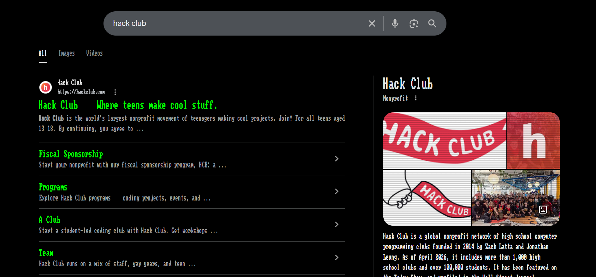
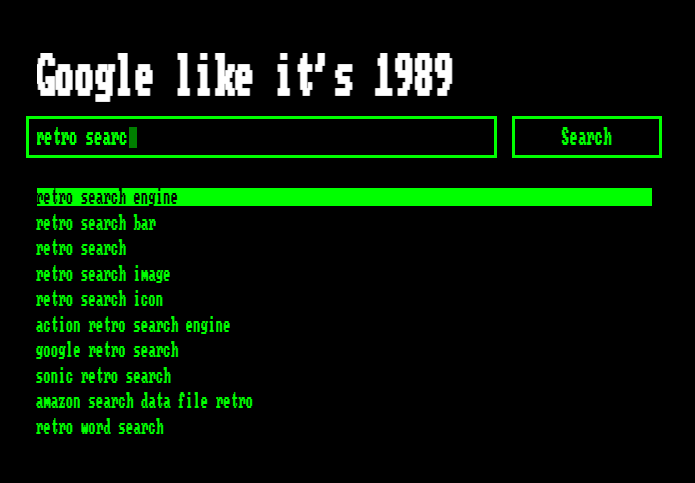
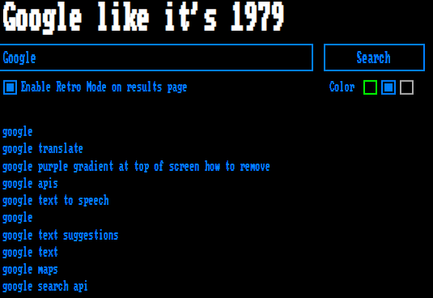
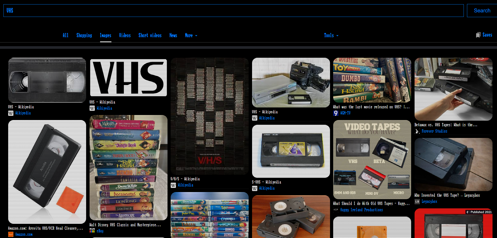
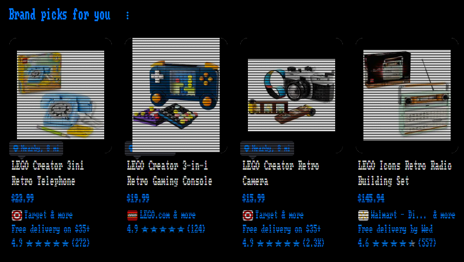

# Retro Google Search
## Google like it's 1979 with this chrome extension that reskins the google search page

    
    

### Installation

1. Download the [latest release](https://github.com/jdszekeres/google-reskin/releases)
2. Unzip the folder
3. visit chrome://extensions
4. Enable Developer Mode in the top right corner
5. Select Load Unpacked and select the folder you unzipped

### Usage

- The Google search results page will automatically update to look retro
- You can use a retro version of the Google homepage by pressing the extension icon

#### Screenshots

    
    
    
    
    

### Features
To make Googling feel retro, on results pages this extension:
- Removes AI Mode
- Removes related search sugggestions
- Applies a Teletype font to everything
- Changes the background to black
- Removes complex buttons, like Google Apps or Profile
- Converts buttons to rectangles
- Simplifies the menu bar

The retro search page has the following features:
- Keyboard-navigatable searching
- Search suggestions
- Toggleable retro mode on results pages

### Permissions
Google like its 1979 uses the following permissions:
- ActiveTab: To control the content on the current tab to look retro
- Scripting: To launch the retro google search page
- Storage: Track whether Retro Mode is on or off